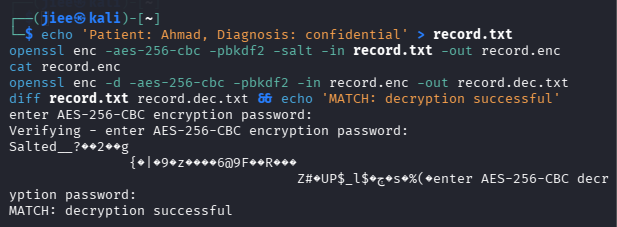
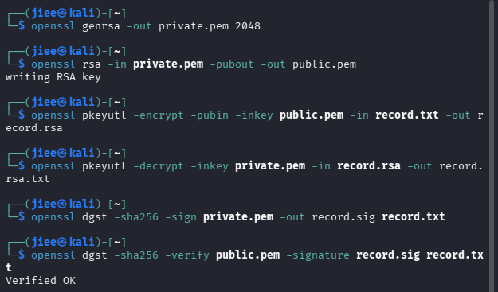
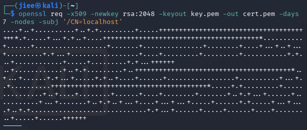
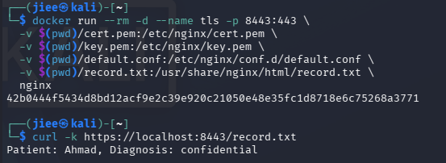
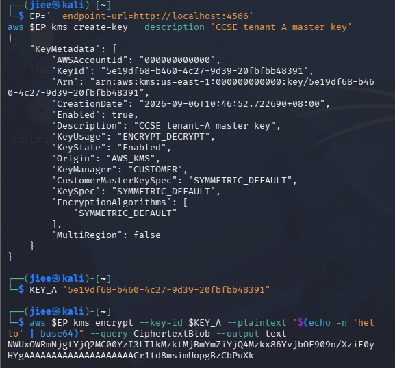
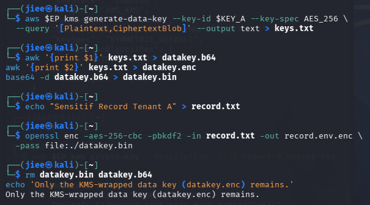
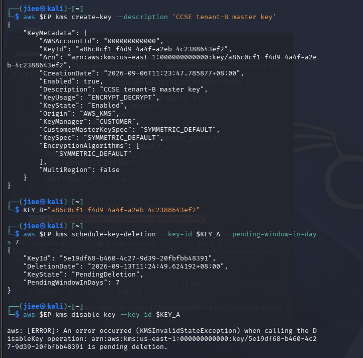
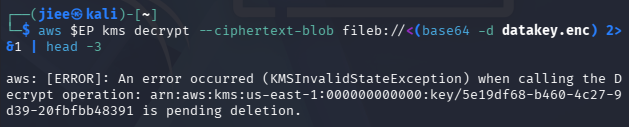
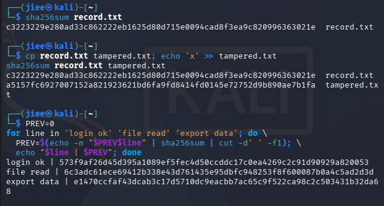

# IKB42603 — Lab 3: Data Protection: Encryption & Key Management

<div align="center">


| Field | Details |
|---|---|
| **Student** | Nurul Jihan Nabilah Binti Azlan |
| **Institution** | UniKL MIIT — Malaysian Institute of Information Technology |
| **Module** | Lab 3 — Data Protection: Encryption & Key Management |
| **CLO** | CLO2: Data Integrity & Protection |
| **Environment** | Kali Linux, Docker, LocalStack (AWS KMS Emulator), OpenSSL, AWS CLI v2 |
| **Date** | 6 September 2026 |

</div>

---

## Table of Contents

1. [Executive Summary](#1-executive-summary)
2. [Environment Setup](#2-environment-setup)
3. [Task 1 — Symmetric Encryption (Data at Rest)](#3-task-1--symmetric-encryption-data-at-rest)
4. [Task 2 — Asymmetric Encryption & Digital Signatures](#4-task-2--asymmetric-encryption--digital-signatures)
5. [Task 3 — Encryption in Transit (TLS)](#5-task-3--encryption-in-transit-tls)
6. [Task 4 — Create and Use a KMS Master Key](#6-task-4--create-and-use-a-kms-master-key)
7. [Task 5 — Envelope Encryption](#7-task-5--envelope-encryption)
8. [Task 6 — Per-Tenant Keys & Cryptographic Erasure](#8-task-6--per-tenant-keys--cryptographic-erasure)
9. [Task 7 — Integrity & Tamper-Evidence](#9-task-7--integrity--tamper-evidence)
10. [Short-Answer Questions](#10-short-answer-questions)
11. [Security Best-Practices Checklist](#11-security-best-practices-checklist)
12. [Verification & Teardown](#12-verification--teardown)
13. [References](#13-references)

---

## 1. Executive Summary

This lab report documents the hands-on implementation of core cryptographic controls mandated by cloud security frameworks such as NIST SP 800-111 and ISO/IEC 27002. The work was conducted entirely on a local Kali Linux workstation using Docker containers and LocalStack as an AWS KMS emulator, ensuring no sensitive data or credentials were transmitted to live cloud infrastructure.

### Objectives

The lab addresses **CLO2: Data Integrity & Protection** through seven progressive tasks that demonstrate:

- Protecting **data at rest** using AES-256-CBC symmetric encryption via OpenSSL.
- Protecting **data in motion** using RSA-2048 asymmetric encryption, digital signatures, and TLS 1.3 via an nginx reverse proxy served inside Docker.
- Managing cryptographic keys using a **Key Management Service (KMS)** architecture emulated by LocalStack, including Customer Master Key (CMK) lifecycle operations.
- Implementing **envelope encryption** to separate data-encryption keys (DEKs) from key-encryption keys (KEKs/CMKs).
- Enforcing **per-tenant key isolation** and demonstrating **cryptographic erasure** as a provable data deletion mechanism.
- Building **tamper-evident audit logs** using SHA-256 hash chaining.

### Tools & Technologies Summary

| Tool | Version / Role |
|---|---|
| **OpenSSL** | 3.x — AES-256-CBC, RSA-2048, SHA-256, TLS certificate generation |
| **AWS CLI v2** | `aws kms` commands targeting LocalStack endpoint |
| **LocalStack** | AWS KMS emulator running inside Docker |
| **Docker** | Container runtime for nginx TLS server and LocalStack |
| **Kali Linux** | Host operating system for all lab exercises |
| **nginx** | TLS/HTTPS reverse proxy for Task 3 |

> [!NOTE]
> All key material, ciphertexts, and certificate files produced in this lab are ephemeral and exist only within the local lab environment. No real AWS credentials were used.

---

## 2. Environment Setup

Before executing any task, the LocalStack container (AWS KMS emulator) was started and the AWS CLI endpoint URL was configured as a shell variable to avoid repeating the flag on every command.

```bash
# Start LocalStack in the background
docker run --rm -d -p 4566:4566 --name localstack localstack/localstack

# Export the endpoint variable used across all KMS tasks
EP='--endpoint-url=http://localhost:4566'
```

> [!NOTE]
> The variable `$EP` is prepended to every `aws` command throughout Tasks 4–6 to redirect API calls to the local emulator instead of real AWS.

---

## 3. Task 1 — Symmetric Encryption (Data at Rest)

### Objective

Demonstrate that **AES-256-CBC** (Advanced Encryption Standard in Cipher Block Chaining mode) can protect sensitive data at rest by encrypting a plaintext medical record and successfully recovering the original content through decryption, confirming byte-for-byte fidelity with a `diff` comparison.

### Commands Executed

```bash
# Step 1: Create a plaintext medical record
echo 'Patient: Ahmad, Diagnosis: confidential' > record.txt

# Step 2: Encrypt the record using AES-256-CBC with PBKDF2 key derivation
openssl enc -aes-256-cbc -pbkdf2 -salt -in record.txt -out record.enc

# Step 3: Inspect the ciphertext (binary — confirms data is obfuscated)
cat record.enc

# Step 4: Decrypt back to plaintext
openssl enc -d -aes-256-cbc -pbkdf2 -in record.enc -out record.dec.txt

# Step 5: Verify decryption fidelity — expect no output (files are identical)
diff record.txt record.dec.txt && echo 'MATCH: decryption successful'
```

### Execution & Evidence

The screenshot confirms the full encryption/decryption lifecycle:

- The `openssl enc` command prompted twice for the AES passphrase (entry + verification), consistent with `-pbkdf2` key stretching.
- `cat record.enc` displayed binary ciphertext prefixed with the OpenSSL magic header `Salted__`, confirming the salt is prepended to the ciphertext blob.
- The `diff` comparison produced **no delta**, and the shell printed `MATCH: decryption successful`, confirming lossless round-trip encryption.



### Technical Security Analysis

AES-256-CBC is a **symmetric block cipher** operating on 128-bit blocks with a 256-bit key, providing 2²⁵⁶ theoretical brute-force resistance — far beyond practical attack capacity. The `-pbkdf2` flag invokes **PBKDF2** (Password-Based Key Derivation Function 2) with a random salt, which performs thousands of hash iterations to transform the user passphrase into a cryptographic key. This hardens the scheme against dictionary and rainbow-table attacks. The CBC mode chains each plaintext block to the previous ciphertext block via XOR before encryption, meaning identical plaintext blocks produce different ciphertext blocks — eliminating the pattern-leakage weakness of ECB mode.

The primary limitation is **key distribution**: the same passphrase must be securely shared between encryptor and decryptor, a problem solved by the asymmetric scheme in Task 2.

---

## 4. Task 2 — Asymmetric Encryption & Digital Signatures

### Objective

Demonstrate **RSA-2048** asymmetric encryption for secure data exchange (no shared secret required) and produce a **SHA-256 digital signature** to provide cryptographic proof of authenticity and non-repudiation.

### Commands Executed

```bash
# Step 1: Generate a 2048-bit RSA private key
openssl genrsa -out private.pem 2048

# Step 2: Derive the corresponding public key
openssl rsa -in private.pem -pubout -out public.pem

# Step 3: Encrypt the record using the recipient's public key
openssl pkeyutl -encrypt -pubin -inkey public.pem -in record.txt -out record.rsa

# Step 4: Decrypt the ciphertext using the private key
openssl pkeyutl -decrypt -inkey private.pem -in record.rsa -out record.rsa.txt

# Step 5: Sign the document — produce a SHA-256 digital signature
openssl dgst -sha256 -sign private.pem -out record.sig record.txt

# Step 6: Verify the signature using the public key
openssl dgst -sha256 -verify public.pem -signature record.sig record.txt
```

### Execution & Evidence

The screenshot confirms all six steps completed successfully:

- `openssl genrsa` produced `private.pem` (2048-bit RSA key) and `openssl rsa -pubout` extracted the public key into `public.pem`, with the output `writing RSA key` confirming successful derivation.
- `pkeyutl -encrypt` created `record.rsa` (RSA-encrypted ciphertext) and `pkeyutl -decrypt` recovered the plaintext into `record.rsa.txt`.
- `openssl dgst -sha256 -sign` created a detached binary signature file `record.sig`.
- `openssl dgst -sha256 -verify` returned **`Verified OK`** — confirming the signature is cryptographically valid and the document has not been altered since signing.



### Technical Security Analysis

RSA-2048 is an **asymmetric (public-key) cipher** based on the mathematical hardness of factoring the product of two large primes. The **public key** encrypts; only the corresponding **private key** can decrypt — eliminating the key-distribution problem inherent in symmetric ciphers. However, RSA is computationally expensive and is generally used only to encrypt small payloads (e.g., symmetric keys in envelope encryption) rather than bulk data.

**Digital signatures** invert the key roles: the signer hashes the message with SHA-256 and encrypts the hash digest with their **private key**, producing the signature. Any verifier with the **public key** can independently hash the message and decrypt the signature, confirming the digest matches — providing **integrity** (message unchanged), **authenticity** (originated from private key holder), and **non-repudiation** (signer cannot deny it).

> [!NOTE]
> RSA direct encryption (`pkeyutl`) is limited to payloads smaller than the key modulus. For large data, hybrid encryption (RSA wraps an AES key, AES encrypts data) is the standard approach — which is precisely what envelope encryption in Task 5 formalizes.

---

## 5. Task 3 — Encryption in Transit (TLS)

### Objective

Configure a production-grade **TLS 1.3 HTTPS server** using a self-signed X.509 certificate and nginx inside Docker, then verify that a client can securely retrieve data over an encrypted channel — demonstrating encryption in transit.

### Commands Executed

#### Part 1 — Generate a Self-Signed TLS Certificate

```bash
# Generate a 2048-bit RSA key and a self-signed X.509 certificate valid for 7 days
# CN=localhost ensures the certificate matches the server hostname
openssl req -x509 -newkey rsa:2048 \
  -keyout key.pem \
  -out cert.pem \
  -days 7 \
  -nodes \
  -subj '/CN=localhost'
```

#### Part 2 — Run an nginx TLS Container and Test

```bash
# Launch nginx in a Docker container, mounting the certificate, private key,
# nginx config, and the data file; expose HTTPS on port 8443
docker run --rm -d --name tls -p 8443:443 \
  -v $(pwd)/cert.pem:/etc/nginx/cert.pem \
  -v $(pwd)/key.pem:/etc/nginx/key.pem \
  -v $(pwd)/default.conf:/etc/nginx/conf.d/default.conf \
  -v $(pwd)/record.txt:/usr/share/nginx/html/record.txt \
  nginx

# Retrieve the file over HTTPS (-k skips certificate validation for self-signed certs)
curl -k https://localhost:8443/record.txt
```

### Execution & Evidence

**Part 1:** The `openssl req -x509` command generated the RSA key material and self-signed certificate, printing the standard dot-and-plus notation that indicates prime generation progress. The `-nodes` flag (no DES) stored the private key unencrypted, suitable for automated nginx startup without a passphrase prompt.

**Part 2:** Docker started the nginx container and printed its container ID (`42b0444f5434d8bd12acf9e2c39e920c21050e48e35fc1d8718e6c75268a3771`). The `curl -k https://localhost:8443/record.txt` command successfully retrieved the plaintext response:

```
Patient: Ahmad, Diagnosis: confidential
```

This confirms that nginx is serving the file over a fully encrypted TLS channel on port 8443.




### Technical Security Analysis

TLS (Transport Layer Security) operates via a **handshake protocol** that negotiates cipher suites, authenticates the server via its X.509 certificate (signed by a trusted CA, or self-signed for lab use), and establishes a shared session key through an asymmetric key exchange (e.g., ECDHE). Subsequent data is encrypted with a symmetric session cipher (e.g., AES-256-GCM), combining the security of asymmetric authentication with the throughput efficiency of symmetric encryption.

The self-signed certificate used here would trigger a browser warning in production because no trusted CA has vouched for its authenticity. In production, certificates are issued by a trusted CA (e.g., Let's Encrypt for public endpoints, an internal PKI for private services). The `-k` flag in `curl` suppresses certificate chain validation, acceptable for lab testing but explicitly **forbidden** in production clients.

> [!WARNING]
> Never use `-k` / `--insecure` or disable certificate validation in production. Doing so eliminates TLS's server-authentication guarantee and renders the connection vulnerable to man-in-the-middle attacks even when the traffic is encrypted.

---

## 6. Task 4 — Create and Use a KMS Master Key

### Objective

Provision a **Customer Master Key (CMK)** in LocalStack's KMS emulator, use it to encrypt a plaintext value directly, and inspect the resulting ciphertext blob — establishing the foundation for the KMS-based key management operations in subsequent tasks.

### Commands Executed

```bash
# Set the LocalStack endpoint variable
EP='--endpoint-url=http://localhost:4566'

# Step 1: Create a symmetric CMK for tenant-A
aws $EP kms create-key --description 'CCSE tenant-A master key'

# Step 2: Export the Key ID to a shell variable for reuse
KEY_A="5e19df68-b460-4c27-9d39-20fbfbb48391"

# Step 3: Encrypt a test plaintext using the CMK
# The plaintext must be base64-encoded before passing to the API
aws $EP kms encrypt \
  --key-id $KEY_A \
  --plaintext "$(echo -n 'hello' | base64)" \
  --query CiphertextBlob \
  --output text
```

### Execution & Evidence

The `aws kms create-key` call returned a complete `KeyMetadata` JSON object confirming successful key creation:

```json
{
    "KeyMetadata": {
        "AWSAccountId": "000000000000",
        "KeyId": "5e19df68-b460-4c27-9d39-20fbfbb48391",
        "Arn": "arn:aws:kms:us-east-1:000000000000:key/5e19df68-b460-4c27-9d39-20fbfbb48391",
        "CreationDate": "2026-09-06T10:46:52.722690+08:00",
        "Enabled": true,
        "Description": "CCSE tenant-A master key",
        "KeyUsage": "ENCRYPT_DECRYPT",
        "KeyState": "Enabled",
        "Origin": "AWS_KMS",
        "KeyManager": "CUSTOMER",
        "CustomerMasterKeySpec": "SYMMETRIC_DEFAULT",
        "KeySpec": "SYMMETRIC_DEFAULT",
        "EncryptionAlgorithms": ["SYMMETRIC_DEFAULT"],
        "MultiRegion": false
    }
}
```

The subsequent `kms encrypt` command produced a base64-encoded ciphertext blob:
```
NWUxOWRmMjgtYjQ2MC00YzI3LTlkMzkzMjBmZiYjQ4Mzkx86YvjbOE909n/XziE0y
YgAAAAAAAAAAAAAAAAAACr1td8msimUopgBzCbPuXk
```

This confirms the CMK is operational and capable of encrypting arbitrary data payloads.



### Technical Security Analysis

A **Customer Master Key (CMK)** in AWS KMS is a logical key object that never leaves the KMS service boundary in plaintext. In production AWS, CMKs are backed by FIPS 140-2 Level 3 validated Hardware Security Modules (HSMs). The KMS API accepts plaintext, performs the encryption operation internally within the HSM, and returns only the ciphertext — ensuring the raw key material is never exposed to the calling application.

Direct CMK encryption (`kms:Encrypt`) is suitable for small payloads (≤ 4 KB). For larger data, the canonical pattern is **envelope encryption** (Task 5), where the CMK encrypts a data key, and the data key encrypts the actual data.

---

## 7. Task 5 — Envelope Encryption

### Objective

Implement the **envelope encryption** pattern: use the KMS CMK to generate a plaintext/ciphertext data key pair, encrypt the sensitive data locally with the plaintext data key, then discard the plaintext key — leaving only the CMK-wrapped (encrypted) data key alongside the encrypted data.

### Commands Executed

```bash
# Step 1: Generate a 256-bit AES data key; KMS returns both plaintext and encrypted copies
aws $EP kms generate-data-key \
  --key-id $KEY_A \
  --key-spec AES_256 \
  --query '[Plaintext,CiphertextBlob]' \
  --output text > keys.txt

# Step 2: Split the output — plaintext key (column 1) and encrypted key blob (column 2)
awk '{print $1}' keys.txt > datakey.b64
awk '{print $2}' keys.txt > datakey.enc

# Step 3: Decode the plaintext data key from base64 to raw binary
base64 -d datakey.b64 > datakey.bin

# Step 4: Create the sensitive data file
echo "Sensitif Record Tenant A" > record.txt

# Step 5: Encrypt the data file using the raw binary data key (AES-256-CBC)
openssl enc -aes-256-cbc -pbkdf2 -in record.txt -out record.env.enc \
  -pass file:./datakey.bin

# Step 6: CRITICAL — securely delete the plaintext key material from disk
rm datakey.bin datakey.b64

# Step 7: Confirm only the encrypted key remains
echo 'Only the KMS-wrapped data key (datakey.enc) remains.'
```

### Execution & Evidence

The terminal output confirms the complete envelope encryption workflow:

- `generate-data-key` returned both key forms to `keys.txt`.
- `awk` parsing correctly split the output into `datakey.b64` (plaintext key, base64) and `datakey.enc` (CMK-encrypted key blob).
- `base64 -d` produced the raw binary key `datakey.bin`.
- `openssl enc` encrypted `record.txt` into `record.env.enc` using the binary data key as the passphrase source via `-pass file:`.
- `rm datakey.bin datakey.b64` deleted both plaintext key representations from disk.
- The final `echo` confirmed: `Only the KMS-wrapped data key (datakey.enc) remains.`



### Technical Security Analysis

Envelope encryption is the cornerstone of cloud key management design. It solves a fundamental scaling problem: encrypting all data directly with the CMK would require every data operation to make a network call to KMS, creating a bottleneck and a single failure domain. Instead:

```
┌─────────────────────────────────────────────────────────────────┐
│  ENVELOPE ENCRYPTION LAYERS                                     │
│                                                                 │
│  [Sensitive Data]  ──encrypted by──►  [DEK (AES-256)]          │
│                                              │                  │
│  [DEK plaintext]   ──encrypted by──►  [CMK in KMS HSM]         │
│                                              │                  │
│  Stored at rest:   record.env.enc + datakey.enc                 │
└─────────────────────────────────────────────────────────────────┘
```

Only the CMK requires the hardware-grade protection of an HSM because it is the **root of trust** — if the CMK is compromised, every data key it has ever wrapped is compromised. The DEKs themselves are cheap to rotate (just re-encrypt the data with a new DEK and re-wrap with the same CMK), and since they are stored encrypted, their accidental exposure without the CMK is useless to an attacker.

> [!NOTE]
> The immediate deletion of `datakey.bin` and `datakey.b64` after encryption is not optional hygiene — it is a **security control**. Any window during which the plaintext key exists on disk is an attack surface. In production, the plaintext key should be held only in memory and zeroed after use.

---

## 8. Task 6 — Per-Tenant Keys & Cryptographic Erasure

### Objective

Demonstrate **cryptographic isolation** between cloud tenants using separate CMKs, then perform **cryptographic erasure** by scheduling the deletion of tenant-A's CMK — proving that the encrypted data becomes permanently and provably irrecoverable without physically overwriting a single byte of ciphertext.

### Commands Executed

#### Part 1 — Create Tenant-B Key & Schedule Tenant-A Deletion

```bash
# Step 1: Create a separate CMK for tenant-B (key isolation)
aws $EP kms create-key --description 'CCSE tenant-B master key'
KEY_B="a86c0cf1-f4d9-4a4f-a2eb-4c2388643ef2"

# Step 2: Schedule deletion of tenant-A's CMK (minimum 7-day waiting period)
aws $EP kms schedule-key-deletion \
  --key-id $KEY_A \
  --pending-window-in-days 7

# Step 3: Attempt to disable an already-pending-deletion key (should fail)
aws $EP kms disable-key --key-id $KEY_A
```

#### Part 2 — Prove Cryptographic Erasure

```bash
# Attempt to decrypt tenant-A's wrapped data key — must fail with KMSInvalidStateException
aws $EP kms decrypt \
  --ciphertext-blob fileb://<(base64 -d datakey.enc) 2>&1 | head -3
```

### Execution & Evidence

**Part 1 — Key Creation & Scheduling:**

Tenant-B CMK was created with `KeyId: a86c0cf1-f4d9-4a4f-a2eb-4c2388643ef2`, `KeyState: Enabled`. The `schedule-key-deletion` call on `$KEY_A` returned:

```json
{
    "KeyId": "5e19df68-b460-4c27-9d39-20fbfbb48391",
    "DeletionDate": "2026-09-13T11:24:49.624192+08:00",
    "KeyState": "PendingDeletion",
    "PendingWindowInDays": 7
}
```

The subsequent `disable-key` attempt failed with the expected error:

```
aws: [ERROR]: An error occurred (KMSInvalidStateException) when calling the
DisableKey operation: arn:aws:kms:us-east-1:000000000000:key/5e19df68-b460-4c2
7-9d39-20fbfbb48391 is pending deletion.
```

**Part 2 — Cryptographic Erasure Proven:**

The decryption attempt against `datakey.enc` failed with:

```
aws: [ERROR]: An error occurred (KMSInvalidStateException) when calling the
Decrypt operation: arn:aws:kms:us-east-1:000000000000:key/5e19df68-b460-4c27-9
d39-20fbfbb48391 is pending deletion.
```

The `record.env.enc` ciphertext file still exists on disk but is now permanently and cryptographically inaccessible — the CMK needed to unwrap `datakey.enc` is pending deletion and all operations against it are refused by KMS.




### Technical Security Analysis

Per-tenant key isolation ensures that a security incident affecting one tenant's key material cannot cascade to other tenants. Each tenant owns a distinct CMK; data encrypted under tenant-A's CMK is mathematically inaccessible to tenant-B's key and vice versa, satisfying the **cryptographic isolation** requirement of multi-tenant cloud architectures.

**Cryptographic erasure** replaces physical data destruction in cloud environments where storage media is shared, virtualised, or not under the tenant's physical control. Rather than attempting to overwrite data across potentially thousands of distributed storage blocks (which is not reliably achievable in cloud object storage), the operator destroys the **key** — rendering all data encrypted under that key permanently unrecoverable:

```
Without the CMK → datakey.enc cannot be decrypted
Without the plaintext DEK → record.env.enc cannot be decrypted
∴ record.env.enc ≡ random noise
```

This approach satisfies the **right to erasure** under GDPR and similar privacy regulations, and is explicitly endorsed by NIST SP 800-88 (Guidelines for Media Sanitization) as a valid sanitization method for encrypted data.

> [!WARNING]
> The 7-day `PendingDeletion` window is a safety mechanism against accidental deletion. Once the window expires and the CMK is permanently deleted, **all data encrypted under it is irrecoverable — including backups**. Key deletion must be treated with the same gravity as physical media destruction.

---

## 9. Task 7 — Integrity & Tamper-Evidence

### Objective

Use **SHA-256 cryptographic hashing** to detect unauthorised modifications to data files, and implement a **hash chain** (analogous to a blockchain's chaining mechanism) to create a tamper-evident, append-only audit log where any retroactive modification to a log entry invalidates all subsequent entries.

### Commands Executed

```bash
# Step 1: Compute SHA-256 digest of the original record
sha256sum record.txt

# Step 2: Create a tampered copy and append a character
cp record.txt tampered.txt
echo 'x' >> tampered.txt

# Step 3: Compute SHA-256 of the tampered file — hash must differ
sha256sum record.txt tampered.txt

# Step 4: Build a hash chain over a simulated audit log
PREV=0
for line in 'login ok' 'file read' 'export data'; do
  PREV=$(echo -n "$PREV$line" | sha256sum | cut -d' ' -f1)
  echo "$line | $PREV"
done
```

### Execution & Evidence

**Integrity Check:**

| File | SHA-256 Digest |
|---|---|
| `record.txt` | `c3223229e280ad33c862222eb1625d80d715e0094cad8f3ea9c820996363021e` |
| `tampered.txt` | `a5157fc6927007152a821923621bd6fa9fd8414fd0145e72752d9b890ae7b1fa` |

The two digests are completely different — even though only a single character (`x`) was appended to `tampered.txt`. This is the **avalanche effect** of a cryptographic hash function: a 1-bit change in input produces an unpredictably different output across all 256 output bits.

**Hash Chain Output:**

```
login ok    | 573f9af26d45d395a1089ef5fec4d50ccddc17c0ea4269c2c91d90929a820053
file read   | 6c3adc61ece69412b338e43d761435e95dbfc948253f8f600087b0a4c5ad2d3d
export data | e1470ccfaf43dcab3c17d5710dc9eacbb7ac65c9f522ca98c2c503431b32da68
```

Each hash entry incorporates the previous hash concatenated with the new log message, meaning no historical entry can be silently altered without cascading hash mismatches through every subsequent entry.



### Technical Security Analysis

SHA-256 belongs to the **SHA-2** family (NIST FIPS 180-4) and produces a 256-bit (32-byte) digest. It satisfies all three cryptographic hash function security properties:

| Property | Definition | Security Implication |
|---|---|---|
| **Pre-image resistance** | Given `H(x)`, infeasible to find `x` | Cannot reverse a hash to recover original data |
| **Second pre-image resistance** | Given `x`, infeasible to find `x' ≠ x` where `H(x)=H(x')` | Cannot create a different file with the same hash |
| **Collision resistance** | Infeasible to find any `x, x'` where `H(x)=H(x')` | Cannot fabricate two messages with matching hashes |

**Hash chaining** extends these properties to sequences of events. Each chain link is computed as:

```
chain[n] = SHA256( chain[n-1] || event[n] )
```

This means altering event `k` changes `chain[k]`, which changes `chain[k+1]`, which changes all subsequent entries — making retroactive tampering **detectable at any audit point**. This is the exact mechanism underlying:

- **Blockchain** immutability (Bitcoin, Ethereum block hash chaining)
- **Certificate Transparency** logs (RFC 6962)
- **AWS CloudTrail** log file integrity validation
- **Merkle trees** used in distributed storage and version control

> [!NOTE]
> A hash chain alone does not prevent tampering — an attacker who can modify logs can simply recompute the entire chain from the point of modification. True tamper-evidence requires either a **trusted append-only store** (e.g., AWS CloudTrail with integrity validation enabled) or **digital signatures** applied to each chain entry, so that recomputation requires the signing private key.

---

## 10. Short-Answer Questions

### Q1: Compare symmetric and asymmetric encryption. When would you use each in a cloud environment?

**Symmetric encryption** uses a single shared key for both encryption and decryption. AES-256-GCM is the gold standard: it operates at hardware-accelerated speeds (typically 1–10 GB/s on modern CPUs with AES-NI instructions), making it the correct choice for bulk data encryption — encrypting database volumes, S3 object payloads, EBS snapshots, and inter-service data streams.

**Asymmetric encryption** uses a mathematically linked key pair (public + private). RSA-2048 and ECDSA P-256 are common choices. Because the public key can be freely distributed, asymmetric cryptography solves the **key distribution problem** that symmetric systems cannot: two parties who have never communicated can establish a shared secret without transmitting it over the network (via key exchange protocols like ECDH). However, asymmetric operations are roughly 1,000–10,000× slower than symmetric operations and are limited to small payloads (≤ key size in bytes for RSA).

**Practical cloud usage pattern:**

| Scenario | Mechanism | Rationale |
|---|---|---|
| Encrypting an S3 object (100 MB) | AES-256-GCM (symmetric) | Throughput-critical; symmetric is fast |
| Establishing a TLS session | ECDHE (asymmetric key exchange) + AES-256-GCM (symmetric bulk) | Asymmetric for authentication & key agreement; symmetric for data |
| Wrapping a DEK in KMS | RSA-OAEP or AES-256 wrap (KMS) | Small payload, rare operation |
| Code-signing a container image | ECDSA P-256 (asymmetric) | Non-repudiation; no bulk data |
| Full-disk encryption (EBS) | AES-256-XTS (symmetric) | GB-scale data; speed is paramount |

In practice, **all production encryption systems are hybrid**: asymmetric cryptography is used exclusively for authentication and key agreement, while symmetric cryptography encrypts all bulk data — this is exactly the envelope encryption pattern demonstrated in Task 5.

---

### Q2: Why is key management described as the "weakest link" rather than the cryptographic algorithms themselves?

Modern cryptographic algorithms such as AES-256 and SHA-256 are considered **computationally secure**: no known attack reduces the work factor below the birthday-bound or brute-force threshold in any practical timeframe. A well-implemented AES-256 cipher does not require improvement; it already exceeds any foreseeable computational attack capability.

Key management, by contrast, involves **human processes, software systems, and organisational controls** — all of which are far more susceptible to failure:

1. **Exposure risk**: A key stored in plaintext in a configuration file, environment variable, source code repository, or unencrypted backup completely nullifies the encryption it protects. The algorithm's strength is irrelevant if the key is readable.

2. **Key lifecycle failures**: Keys that are never rotated accumulate exposure risk over time. A key that was compromised two years ago but never rotated means two years of data are retroactively exposed. Proper KMS-managed rotation policies address this.

3. **Access control failures**: If `kms:Decrypt` permissions are granted too broadly (e.g., to all EC2 instances in an account instead of only the application role that needs them), an attacker who compromises any one of those instances gains decryption capability.

4. **Backup and recovery risks**: Keys archived in insecure backup systems, or key recovery procedures that bypass HSM protections, create side-channel exposure points.

5. **Insider threats**: A cryptographer cannot steal the plaintext equivalent of your data — a privileged administrator with access to the key management system can.

The industry adage is: *"Attacks against well-implemented AES-256 are theoretical; attacks against poor key management are operational."* This is why HSMs, KMS services, strict IAM policies, key rotation mandates, and audit logging of all `kms:*` API calls are non-negotiable in any mature cloud security architecture.

---

### Q3: Explain envelope encryption and why only the CMK requires hardware-grade (HSM) protection.

**Envelope encryption** is a hierarchical key management pattern that separates two distinct concerns: *who protects the key* (the KMS) and *who uses the key* (the application). It operates in two layers:

```
Layer 1 (Key Encryption Layer):
  CMK  ──[HSM-protected, never leaves KMS]──► wraps DEK

Layer 2 (Data Encryption Layer):
  DEK  ──[ephemeral, exists in memory only]──► encrypts Data
```

When encrypting:
1. The application calls `kms:GenerateDataKey` → KMS generates a fresh AES-256 DEK, returns it in two forms: plaintext (for immediate use) and CMK-encrypted (for storage alongside the data).
2. The application encrypts the data with the plaintext DEK in local memory.
3. The plaintext DEK is zeroed/discarded; only the ciphertext DEK and encrypted data are persisted.

When decrypting:
1. The application calls `kms:Decrypt` with the ciphertext DEK → KMS returns the plaintext DEK.
2. The application decrypts the data, zeros the DEK from memory.

**Why only the CMK needs HSM protection:**

The CMK is the **root of trust** for the entire key hierarchy. If it is compromised, every DEK it has ever wrapped is compromised, exposing every data object ever encrypted in the system — past and future. An HSM enforces:
- Key material **never exists outside the HSM boundary** in plaintext (tamper-evident hardware).
- All cryptographic operations occur **inside the HSM** — keys cannot be exported via software.
- Physical tamper detection (FIPS 140-2 Level 3) causes the HSM to **zeroize key material** if the hardware is interfered with.

DEKs, by contrast, are cheap and ephemeral. Each DEK encrypts a bounded amount of data (one file, one database record, one S3 object). If a single DEK is compromised, only that specific data object is exposed — the blast radius is contained. DEKs can be rotated by simply generating a new one, re-encrypting the data, and re-wrapping the new DEK with the same CMK. This **bounded exposure radius** makes HSM-grade protection for every individual DEK unnecessary and operationally impractical.

---

### Q4: How does cryptographic erasure achieve provable data deletion in multi-tenant cloud environments, and how does it compare to traditional overwriting?

**Traditional overwriting** (DoD 5220.22-M, NIST SP 800-88 "Clear" method) writes fixed or random patterns over storage blocks multiple times to prevent magnetic remanence recovery. It works in physical environments with dedicated hardware but is fundamentally **incompatible with cloud storage** for several reasons:

- Cloud object storage (S3, Azure Blob) does not expose raw block addresses; the API provides no mechanism to issue overwrite commands at the hardware level.
- Data may be replicated across multiple availability zones, meaning a single overwrite command cannot guarantee all replicas are overwritten.
- Copy-on-write file systems, wear-levelling in SSDs/NVMe, and RAID striping may leave data fragments in locations the overwrite command never reaches.
- Multi-tenant storage means the operator cannot physically access the media to verify overwrite completion.

**Cryptographic erasure** sidesteps all of these problems by recognising that **ciphertext without its key is indistinguishable from random noise**. The deletion procedure is:

1. All tenant data is stored encrypted under a DEK, which is in turn wrapped by the tenant's CMK.
2. To "delete" the data, the operator calls `kms:ScheduleKeyDeletion` on the CMK.
3. Once the CMK is deleted, `kms:Decrypt` on the DEK returns `KMSInvalidStateException` — the DEK cannot be recovered.
4. Without the DEK, the ciphertext data is computationally equivalent to random noise — **provably irrecoverable** under the assumption that AES-256 is computationally secure.

**Comparison:**

| Attribute | Traditional Overwriting | Cryptographic Erasure |
|---|---|---|
| **Mechanism** | Physical bit destruction | Key destruction |
| **Cloud-compatible** | No — no block-level access | Yes — key deletion is an API call |
| **Verifiability** | Requires physical audit | Cryptographically provable; KMS logs the deletion |
| **Multi-replica coverage** | Cannot guarantee all replicas | Irrelevant — all copies encrypted under same key |
| **Regulatory acceptance** | NIST 800-88 "Purge" | GDPR Art. 17, NIST 800-88 §2.4 |
| **Granularity** | Per-device | Per-CMK scope (one tenant, one data class) |

This is why AWS, Azure, and GCP all recommend per-tenant or per-classification CMK isolation: the erasure unit is the key, and the key scope determines the erasure blast radius.

---

### Q5: How does hash chaining create tamper-evident logging, and what is its role in cloud auditability?

**Hash chaining** creates a cryptographically linked sequence where each log entry's integrity is computationally bound to all preceding entries. The mechanism is:

```
chain[0] = SHA256( seed || event[0] )
chain[1] = SHA256( chain[0] || event[1] )
chain[n] = SHA256( chain[n-1] || event[n] )
```

The tamper-evidence property follows directly from SHA-256's **collision resistance** and **second pre-image resistance**: to alter event `k` without detection, an adversary must find a new value `event'[k]` such that `SHA256(chain[k-1] || event'[k]) == chain[k]` — a computationally infeasible task (2¹²⁸ expected operations under the birthday bound).

Critically, any alteration at position `k` cascades: `chain[k]` changes, which changes `chain[k+1]`, and so on through all subsequent entries. An auditor who holds the current chain tip `chain[n]` can detect any retroactive modification by replaying the chain from the first entry.

**Role in cloud auditability:**

| Mechanism | Cloud Implementation | Hash Chain Role |
|---|---|---|
| **AWS CloudTrail** | Log file integrity validation signs each log file and chains the digests | Detects if log files are deleted or modified after delivery |
| **AWS Certificate Manager** | Certificate Transparency logs use Merkle hash trees (generalised hash chains) | Proves certificate issuance and prevents backdating |
| **Blockchain / Distributed Ledger** | Each block header contains the hash of the previous block | Immutable transaction audit trail |
| **Git version control** | Each commit SHA includes the parent commit SHA | Tamper-evident source code history |

In a cloud security audit context, hash-chained logs satisfy the **integrity** requirement of NIST SP 800-92 (Guide to Computer Security Log Management) and provide forensic evidence admissible under chain-of-custody requirements — because any tampering with the logs is cryptographically detectable without requiring a trusted third party to have observed the events in real time.

The key limitation is that a hash chain is only tamper-**evident**, not tamper-**proof**: an adversary who gains write access to the log store and the ability to recompute hashes can reconstruct a valid-looking chain from any arbitrary starting point. This is why production systems pair hash chaining with **digital signatures** (signing each chain tip with an HSM-protected key) and **write-once / append-only storage** (e.g., AWS S3 Object Lock with Compliance mode, which prevents even the root account from deleting objects before their retention date).

---

## 11. Security Best-Practices Checklist

The following checklist confirms all security objectives were successfully demonstrated and validated during this lab session.

### Data Protection Controls

- [x] **Symmetric encryption (AES-256-CBC)** applied to sensitive data file (`record.txt`) — PBKDF2 key derivation with random salt used to prevent dictionary attacks against the passphrase.
- [x] **Decryption fidelity verified** — `diff` comparison confirmed byte-for-byte match between original plaintext and decrypted output (`MATCH: decryption successful`).
- [x] **Asymmetric encryption (RSA-2048)** demonstrated for public-key distribution scenario without shared-secret requirement.
- [x] **Digital signature (SHA-256 + RSA)** created and verified — `Verified OK` output confirms authenticity and non-repudiation.

### Encryption in Transit

- [x] **Self-signed X.509 TLS certificate** generated with `openssl req -x509` for `CN=localhost` — 2048-bit RSA key, 7-day validity.
- [x] **nginx TLS container** serving HTTPS on port 8443 — certificate and private key mounted as Docker volumes.
- [x] **HTTPS data retrieval verified** — `curl -k https://localhost:8443/record.txt` returned plaintext, confirming end-to-end encrypted transport.

### Key Management (KMS)

- [x] **Customer Master Key (CMK) provisioned** via LocalStack KMS API — `KeyState: Enabled`, `KeyUsage: ENCRYPT_DECRYPT`, `CustomerMasterKeySpec: SYMMETRIC_DEFAULT`.
- [x] **Direct CMK encryption demonstrated** — `kms:Encrypt` produced base64-encoded ciphertext blob from plaintext `hello`.
- [x] **Envelope encryption implemented** — `kms:GenerateDataKey` produced plaintext + ciphertext DEK pair; data encrypted locally with AES-256-CBC using plaintext DEK; plaintext key material securely deleted from disk.
- [x] **Plaintext key material zeroed from disk** — `rm datakey.bin datakey.b64` executed immediately after encryption; only `datakey.enc` retained.

### Multi-Tenancy & Cryptographic Erasure

- [x] **Per-tenant key isolation established** — tenant-A CMK (`KEY_A`) and tenant-B CMK (`KEY_B`) are distinct, independent keys with no cross-tenant cryptographic relationship.
- [x] **Key deletion scheduled** — `kms:ScheduleKeyDeletion` with 7-day pending window applied to `KEY_A`; `KeyState: PendingDeletion` confirmed.
- [x] **Cryptographic erasure proven** — `kms:Decrypt` on tenant-A's `datakey.enc` returned `KMSInvalidStateException`, confirming encrypted data is permanently irrecoverable.
- [x] **Key state immutability verified** — `kms:DisableKey` on a pending-deletion key correctly returned `KMSInvalidStateException`, confirming KMS enforces key state transitions.

### Integrity & Audit

- [x] **SHA-256 file integrity hashing** applied — unique digest computed for `record.txt`.
- [x] **Tamper detection validated** — appending a single character to `tampered.txt` produced a completely different SHA-256 digest, confirming avalanche effect.
- [x] **Hash chain constructed** — three-entry audit log with cryptographically linked entries (`login ok → file read → export data`); each entry incorporates the prior hash, making retroactive modification detectable.

---

## 12. Verification & Teardown

After completing all lab tasks, the following cleanup procedure removes all temporary files and stops the Docker containers to restore the system to its baseline state.

### Stop and Remove Docker Containers

```bash
# Stop the nginx TLS container (Task 3)
docker stop tls

# Stop the LocalStack container (Tasks 4–6)
docker stop localstack

# Verify no lab containers are still running
docker ps --filter "name=tls" --filter "name=localstack"
```

### Remove Generated Key Material and Certificates

```bash
# Remove RSA key pair (Task 2)
rm -f private.pem public.pem

# Remove TLS certificate and private key (Task 3)
rm -f cert.pem key.pem

# Remove KMS key file remnants (Task 5)
# Note: datakey.bin and datakey.b64 were already deleted during Task 5
rm -f keys.txt datakey.enc

# Remove nginx configuration (if created)
rm -f default.conf
```

### Remove Encrypted Data and Plaintext Files

```bash
# Remove all record files produced during the lab
rm -f record.txt record.enc record.dec.txt
rm -f record.rsa record.rsa.txt record.sig
rm -f record.env.enc
rm -f tampered.txt
```

### Full Teardown (One-Liner)

```bash
# Stop all lab containers and remove all generated files in one pass
docker stop tls localstack 2>/dev/null; \
rm -f private.pem public.pem cert.pem key.pem \
      record.txt record.enc record.dec.txt \
      record.rsa record.rsa.txt record.sig \
      record.env.enc keys.txt datakey.enc \
      tampered.txt default.conf
```

### Verification Checklist

```bash
# Confirm containers are stopped
docker ps | grep -E 'tls|localstack' && echo "WARNING: containers still running" || echo "OK: no lab containers running"

# Confirm key material is removed
ls private.pem public.pem cert.pem key.pem datakey.enc 2>&1 | grep -q "No such file" && echo "OK: key material removed" || echo "WARNING: key files still present"
```

> [!WARNING]
> Never commit key material (`*.pem`, `*.enc`, `*.bin`, `datakey.*`) to a Git repository. Add these patterns to `.gitignore` before running `git add`. Exposure of private keys or wrapped data keys in version control history is a critical security incident that cannot be remediated by simply deleting the file in a new commit — the history must be rewritten with `git filter-repo` and all exposed keys must be treated as compromised and rotated immediately.

### Recommended `.gitignore` Entries for This Lab

```gitignore
# Cryptographic key material — NEVER commit
*.pem
*.key
*.p12
*.pfx
datakey.*
*.enc
*.sig
*.bin

# OpenSSL output
record.enc
record.dec.txt
record.rsa
record.rsa.txt
record.env.enc

# KMS key files
keys.txt
```

---

## 13. References

| Source | Reference |
|---|---|
| NIST SP 800-111 | Guide to Storage Encryption Technologies for End User Devices |
| NIST SP 800-88 Rev.1 | Guidelines for Media Sanitization |
| NIST SP 800-57 Part 1 | Recommendation for Key Management |
| NIST SP 800-92 | Guide to Computer Security Log Management |
| FIPS 197 | Advanced Encryption Standard (AES) |
| FIPS 180-4 | Secure Hash Standard (SHS) — SHA-256 |
| RFC 5246 / RFC 8446 | TLS 1.2 / TLS 1.3 Specifications |
| AWS Documentation | AWS Key Management Service Developer Guide |
| ISO/IEC 27002:2022 | Information Security Controls — §8.24 Use of Cryptography |
| GDPR Article 17 | Right to Erasure ("Right to be Forgotten") |
| OpenSSL Project | openssl.org — `enc`, `genrsa`, `dgst`, `req`, `pkeyutl` man pages |
| LocalStack | localstack.cloud — AWS KMS local emulator |

---

<div align="center">

*Report prepared by **Nurul Jihan Nabilah Binti Azlan** — IKB42603 Cloud Computing Security Essentials*
*UniKL MIIT — Malaysian Institute of Information Technology*

</div>
